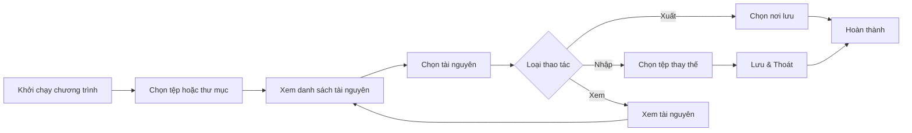

<!-- Vietnamese version -->
# 🎮 UABE cho Arena of Valor (AOV_UABE_2022)

[](https://opensource.org/licenses/MIT)
[](https://www.python.org/downloads/)
[](https://www.microsoft.com/windows)
[](http://ld.ymkeji.xyz/)

[简体中文](README.md) | [English](README.en.md) | **Tiếng Việt**

<div align="center">

### 🔧 Trình chỉnh sửa AssetBundle đồ họa dành riêng cho Arena of Valor

Công cụ giao diện người dùng (GUI) này là sản phẩm phát triển thứ cấp dựa trên khung giao diện người dùng của dự án gốc: https://github.com/KennyYang0726/UABE_AOV?utm_source=chatgpt.com
---

## 🌐 Trải nghiệm phiên bản web

**Không cần tải xuống — mở ngay trong trình duyệt!** Phiên bản web của UABE đã đầy đủ tính năng như desktop:

### 🚀 [Khởi chạy phiên bản web](http://ld.ymkeji.xyz/)

**Điểm nổi bật của web:**
- ✨ Hoạt động ngay trên trình duyệt, không cần cài đặt
- 🔐 Mọi thao tác xử lý cục bộ, bảo vệ quyền riêng tư
- 📱 Tương thích đa nền tảng (Windows/Mac/Linux)
- 🎯 Tính năng song hành với bản desktop
- ⚡ Đáp ứng nhanh, thao tác mượt mà

> 💡 **Gợi ý**: Dùng web để thử nghiệm nhanh; với các tệp lớn hoặc xử lý hàng loạt, hãy sử dụng bản desktop.

---

[📥 Tải bản desktop](https://github.com/Alanshown/AOV_UABE_2022/releases/download/Latest/AOV_UABE_v2.0.0.zip)

</div>

---

## 📋 Mục lục

- [✨ Tổng quan](#-tổng-quan)
- [🎯 Tính năng cốt lõi](#-tính-năng-cốt-lõi)
- [🚀 Cách sử dụng](#-cách-sử-dụng)
- [💖 Hỗ trợ dự án](#-hỗ-trợ-dự-án)

---

## ✨ Tổng quan

**UABE cho Arena of Valor** là công cụ đồ họa dành riêng cho các AssetBundle của Liên Quân. Dự án xây dựng trên nền tảng nâng cấp **UnityPy** của [K0lb3](https://github.com/K0lb3), bổ sung luồng mã hóa/giải mã đặc thù cho AOV.

### 🌟 Điểm nổi bật

- 🎨 **Giao diện hiện đại** - Tkinter mang lại trải nghiệm trực quan
- 🔐 **Hỗ trợ mã hóa AOV** - Xử lý hoàn toàn định dạng tài nguyên của Liên Quân
- 📁 **Xử lý hàng loạt** - Mở tệp đơn lẻ hoặc toàn bộ thư mục
- 🖼️ **Đa dạng tài nguyên** - Raw, Texture2D, Mesh và nhiều hơn nữa
- 🌍 **Đa ngôn ngữ** - Hỗ trợ Tiếng Trung Phồn thể, Giản thể, Tiếng Anh, Tiếng Việt
- 🎯 **Chỉnh sửa chính xác** - Xuất, nhập và điều chỉnh tài nguyên ngay trong GUI

---

## 📱 Chạy trên Termux (Android)

Ngoài bản GUI cho Windows, dự án có **AOV Asset Tool** — công cụ dòng lệnh
(CLI) chạy thẳng trên **Termux Android**, không cần màn hình đồ hoạ.

### Cài đặt

```bash
pkg install python
pip install -r requirements_termux.txt
```

> Bundle AOV mã hoá bằng SM4 — tool đã có sẵn SM4 thuần Python dự phòng nên
> **không bắt buộc** cài package `sm4`.

### Sử dụng

```bash
python main.py            # menu tương tác
python main.py list       # liệt kê toàn bộ asset trong input/
python main.py export     # xuất tất cả asset ra output/
python main.py import     # nhập lại & đóng gói bundle vào osave/
```

### Quy trình mod

1. Chép `.assetbundle` gốc vào thư mục `input/`
2. `python main.py export` — asset xuất ra `output/` theo định dạng:
   - **Texture2D / Sprite** → `.png`
   - **Mesh** → `.obj`
   - **TextAsset** → `.txt` / `.bin`
   - **AudioClip** → `.wav` / `.ogg`
   - **AnimationClip** và mọi loại khác → `.json` (typetree, kiểu UABE dump)
3. Chỉnh sửa file trong `output/` (giữ nguyên tên file để tool nhận diện)
4. `python main.py import` — bundle đã mod lưu tại `osave/`
5. Chép bundle trong `osave/` đè vào game để áp dụng mod

> ⚠️ Quy ước tên file `{bundle}__{loại}__{tên}__{pathID}.{đuôi}` được dùng để
> ghép asset trở lại đúng bundle — đừng đổi tên file đã xuất.

---

## 🎯 Tính năng cốt lõi

<table>
<thead>
<tr>
<th width="20%">Module</th>
<th width="40%">Mô tả</th>
<th width="20%">Định dạng</th>
<th width="20%">Thao tác</th>
</tr>
</thead>
<tbody>
<tr>
<td><strong>📤 Xuất Raw</strong></td>
<td>Trích xuất dữ liệu thô mà không làm mất cấu trúc gốc</td>
<td><code>.bytes</code></td>
<td>Xuất</td>
</tr>
<tr>
<td><strong>📥 Nhập Raw</strong></td>
<td>Thay thế dữ liệu với file thô đã chỉnh sửa (phải cùng loại)</td>
<td><code>.bytes</code></td>
<td>Nhập</td>
</tr>
<tr>
<td><strong>🖼️ Xuất ảnh</strong></td>
<td>Đổi Texture2D thành ảnh tiêu chuẩn</td>
<td><code>.png</code></td>
<td>Xuất</td>
</tr>
<tr>
<td><strong>🎨 Nhập ảnh</strong></td>
<td>Thay hình tùy chỉnh, đảm bảo độ phân giải đồng nhất</td>
<td><code>.png</code> <code>.jpg</code></td>
<td>Nhập</td>
</tr>
<tr>
<td><strong>🗿 Xuất Mesh</strong></td>
<td>Xuất lưới mô hình 3D sang OBJ để mở bằng phần mềm khác</td>
<td><code>.obj</code></td>
<td>Xuất</td>
</tr>
<tr>
<td><strong>👁️ Xem trước</strong></td>
<td>Kết xuất hình ảnh và mô hình 3D bằng OpenGL</td>
<td>Nhiều loại</td>
<td>Xem</td>
</tr>
<tr>
<td><strong>💾 Lưu & Thoát</strong></td>
<td>Lưu mọi thay đổi vào AssetBundle mới</td>
<td><code>.assetbundle</code></td>
<td>Lưu</td>
</tr>
<tr>
<td><strong>📂 Hàng loạt</strong></td>
<td>Mở thư mục và xử lý nhiều tệp cùng lúc</td>
<td>Thư mục</td>
<td>Hàng loạt</td>
</tr>
</tbody>
</table>

---

## 🚀 Cách sử dụng

### Luồng hoạt động



### Các bước cụ thể

#### 1️⃣ Cài phụ thuộc và khởi động
- Chạy `pip install -r requirements.txt`
- Thực thi `python main.py`
- Hoặc tải [📥 bản desktop](https://github.com/Alanshown/AOV_UABE_2022/releases/download/Latest/AOV_UABE_v2.0.0.zip) và chạy EXE

#### 2️⃣ Mở tài nguyên

**Tệp đơn lẻ**:
- Menu → `File` → `Open File` → chọn `.assetbundle`

**Thư mục**:
- Menu → `File` → `Open Directory` → chọn thư mục chứa nhiều `.assetbundle`

#### 3️⃣ Xem chi tiết

- Nhấn `Info` trên giao diện chính
- Xem toàn bộ tài nguyên trong cửa sổ bật lên
- Sắp xếp theo tên/loại/kích thước

#### 4️⃣ Thực hiện thao tác

**Xuất**:
1. Chọn tài nguyên
2. Nhấn nút xuất liên quan
3. Chọn vị trí lưu

**Nhập**:
1. Chọn tài nguyên
2. Nhấn nút nhập tương ứng
3. Chọn tệp thay thế
4. Xác nhận ghi đè

**Xem trước**:
- Chọn tài nguyên để xem
- Panel bên phải hiển thị tự động
- Dùng chuột xoay khi xem Mesh trong 3D

#### 5️⃣ Lưu kết quả

- Nhấn `Save & Exit`
- Chọn thư mục đầu ra
- Chương trình tạo AssetBundle đã chỉnh sửa

---

### 🔑 Tài nguyên được hỗ trợ

| Tài nguyên | Mô tả | Thao tác |
|---------|------|---------|
| **Texture2D** | Tài nguyên 2D | ✅ Xuất / ✅ Nhập / ✅ Xem |
| **Sprite** | Đồ họa sprite | ✅ Xuất / ✅ Nhập |
| **Mesh** | Lưới 3D | ✅ Xuất / ✅ Nhập (OBJ) / ✅ Xem |
| **TextAsset** | Tệp văn bản | ✅ Xuất / ✅ Nhập |
| **AnimationClip** | Clip hoạt ảnh | ✅ Xuất / ✅ Nhập (JSON) |
| **AudioClip** | Tài nguyên âm thanh | ✅ Xuất |
| **Mọi loại khác** | Bất kỳ asset nào | ✅ Xuất / ✅ Nhập (JSON typetree / RAW) |
| **Material** | Vật liệu | ✅ Xem |
| **Shader** | Shader | ✅ Xem |

---

## 💖 Hỗ trợ dự án

<div align="center">
  <div style="background: radial-gradient(circle at top, rgba(255,255,255,0.25), rgba(0,0,0,0.65)), linear-gradient(135deg, #1c1c1c, #121212); padding: 24px; border-radius: 24px; box-shadow: 0 0 40px rgba(0,0,0,0.75); max-width: 420px;">
    <div style="position: relative; display: inline-block;">
      
      <div style="position: absolute; top: 12px; left: 12px; background: rgba(0,0,0,0.7); color: #fff; padding: 4px 10px; border-radius: 10px; font-weight: 600; font-size: 14px;">Mời tôi uống cà phê / Buy me coffee</div>
    </div>
    <p style="margin: 16px 0 0; color: #f0f0f0;">Nếu công cụ hữu ích, một ly cà phê là động lực để chúng tôi tiếp tục cập nhật!</p>
  </div>
</div>
